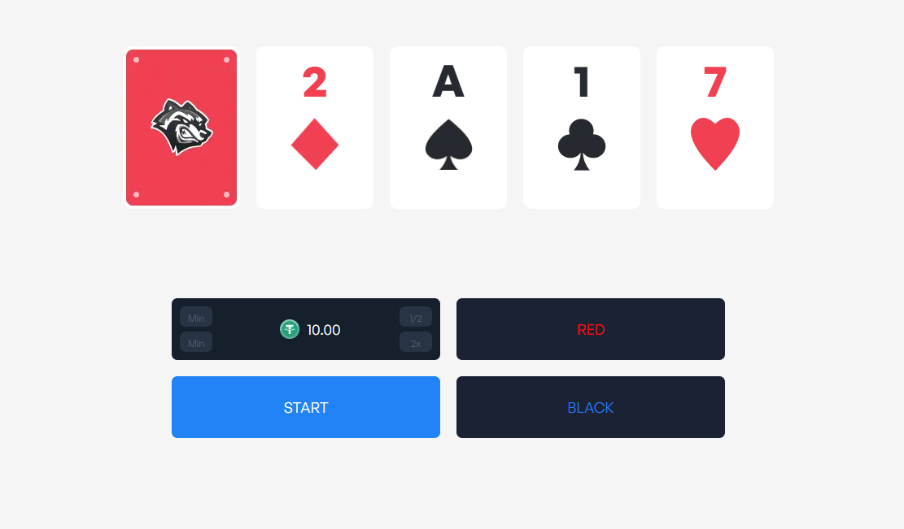
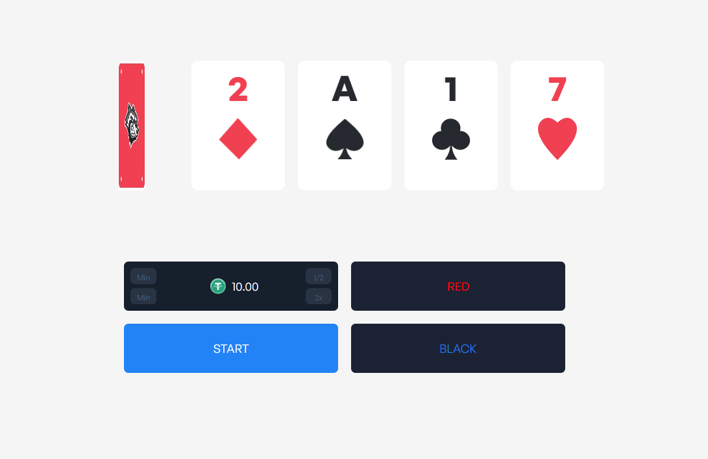
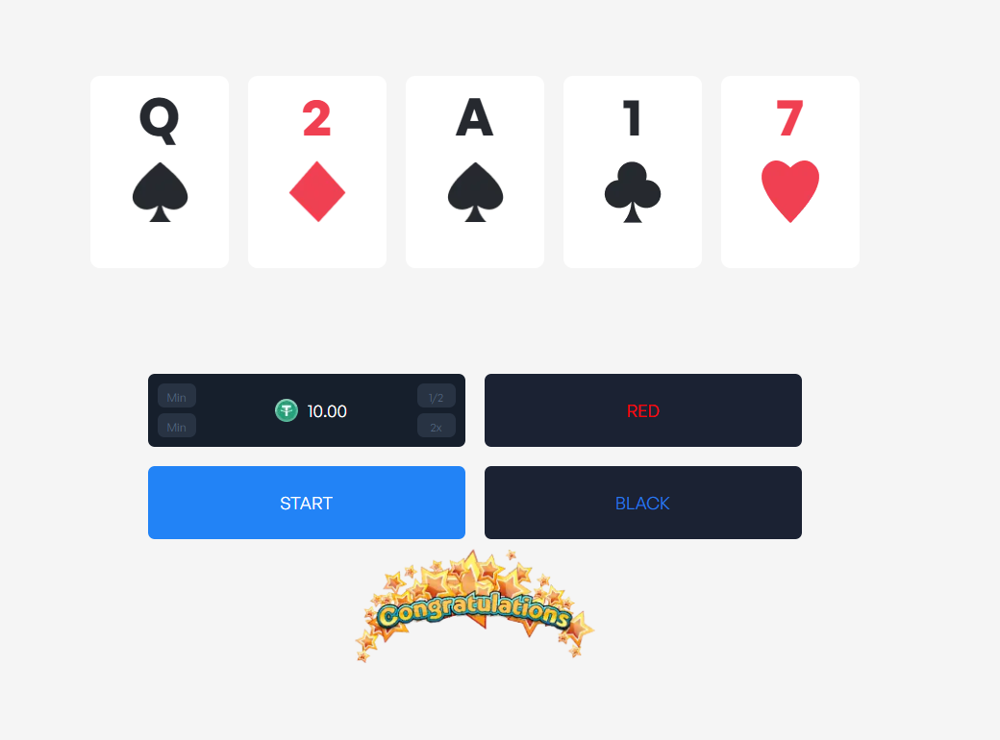
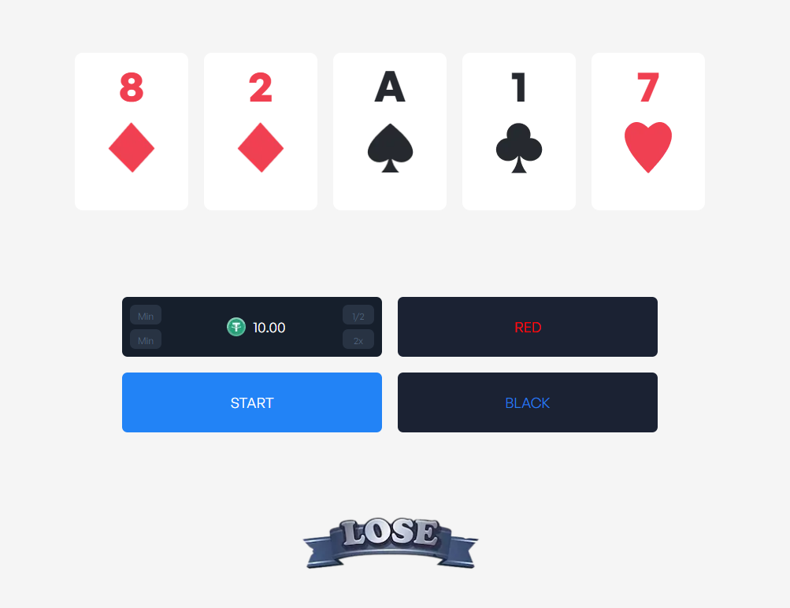

# React Game Coding Task

Welcome! Today, I'm building a working game in React/Next.js.

The goal of this project is fun!!!

### Red or Black - Game Rules

A game starts with a pack of (infinite) cards, face down, and one card next to it, face up. The player continues guesses whether the next card is red or black, until they guess incorrectly and lose!

#### How to play `Red or Black`.

1. The player presses start to lock in their bet.
2. The player chooses whether the next card is red, or black.

3. Outcome: Correct guess
    The player can play again and guess the next card
    Update the UI to show this.

4. Outcome: Wrong guess
    Player loses, game UI resets to default.
